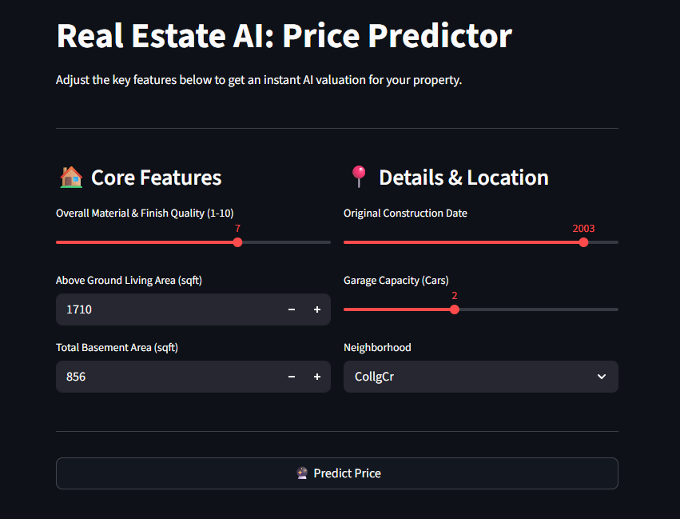

# Real Estate AI: House Price Predictor

[](THAY_LINK_WEB_STREAMLIT_CỦA_BẠN_VÀO_ĐÂY)
[](https://www.python.org/)
[](https://scikit-learn.org/)

## Overview / Dataset Context
This project is an end-to-end Machine Learning web application designed to predict the market value of residential properties in Ames, Iowa. By leveraging advanced regression techniques and an automated data preprocessing pipeline, the AI model provides instant and accurate price estimates based on key property features. 

The dataset used in this project is the famous Ames Housing dataset. It contains 79 explanatory variables describing (almost) every aspect of residential homes in Ames, Iowa.

## UI Sneak Peek


## Key Features
* **Automated Data Pipeline:** Built a robust `scikit-learn` Pipeline utilizing `SimpleImputer`, `StandardScaler`, and `OneHotEncoder` to automatically handle missing values and categorical data while strictly preventing **Data Leakage**.
* **Outlier Handling:** Conducted Exploratory Data Analysis (EDA) to identify and remove critical outliers, significantly improving the model's boundary decision.
* **Hyperparameter Tuning & Evaluation:** Trained and compared multiple algorithms including Linear Regression, Ridge (L2), Lasso (L1), and Random Forest (tuned via `GridSearchCV`).
* **Feature Selection via Lasso:** The champion model, **Lasso Regression**, achieved an **$R^2$ Score of 90.40%** by inherently performing feature selection (shrinking irrelevant feature weights to zero) in a highly dimensional dataset.
* **Interactive UI:** Deployed an intuitive and responsive web interface using **Streamlit**.

## Tech Stack
* **Language:** Python
* **Data Processing & EDA:** Pandas, NumPy, Matplotlib, Seaborn
* **Machine Learning:** Scikit-Learn, Joblib
* **Web Framework & Deployment:** Streamlit, Streamlit Community Cloud

## Project Structure
```text
House_Price_Prediction/
│
├── data/
│   ├── train.csv                # Raw Ames Housing dataset
│   └── data_description.txt     # Data dictionary
│
├── model/
│   └── house_price_model.pkl    # Exported champion model (Lasso)
│
├── notebooks/
│   ├── 01_EDA.ipynb             # Exploratory Data Analysis & Visualizations
│   └── 02_Model_Training.ipynb  # Pipeline building, Model training, & Tuning
│
├── app.py                       # Streamlit web application script
├── requirements.txt             # Project dependencies
└── README.md                    # Project documentation
```

## How to Run Locally
* **Clone the repository:**
```bash
git clone [https://github.com/](https://github.com/)[YOUR_GITHUB_USERNAME]/House_Price_Prediction.git
cd House_Price_Prediction
```

* **Create a virtual environment (Optional but highly recommended):**
```text
python -m venv venv
# On Windows:
venv\Scripts\activate
# On macOS/Linux:
source venv/bin/activate
```

* **Install the required dependencies:**
```text
pip install -r requirements.txt
```

* **Launch the web application:**
```text
streamlit run app.py
```

## Future Improvements
* **Advanced Gradient Boosting:** Integrating XGBoost or LightGBM to see if tree-based ensemble methods can outscore the linear models after extensive hyperparameter tuning.
* **Geospatial Visualization:** Adding a map component to visually plot housing prices across different Ames neighborhoods.
* **Expanded User Inputs:** Allowing users to input more granular details via an "Advanced Settings" toggle in the UI.

## Conclusion
This project successfully demonstrates the complete lifecycle of a Machine Learning product—from raw data ingestion, exploratory analysis, and outlier removal, to automated pipeline construction and deployment. By prioritizing clean code and an interactive user experience, this tool bridges the gap between complex data science algorithms and accessible real estate insights.